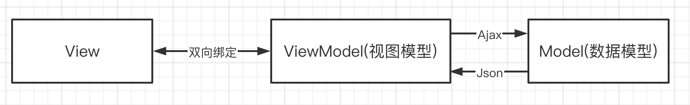
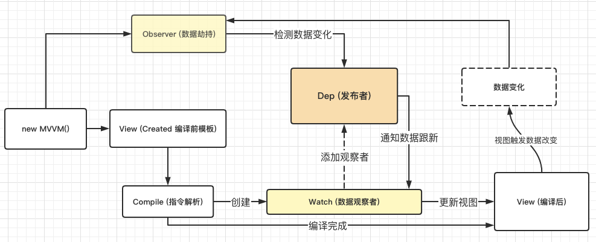
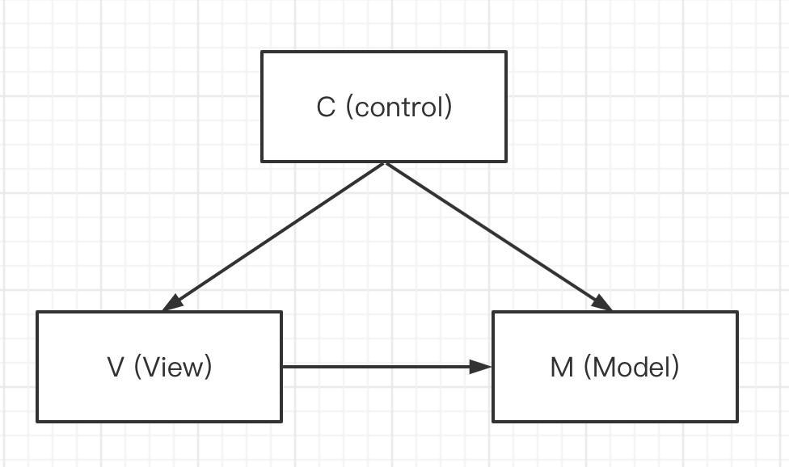

# 了解 MVVM

## 总结

1. 由 View - Model - ViewModel 组成
2. 目的解决了 MVC 模型中的 Controller 的压力
3. 引入 ViewModel ，只关心数据和业务处理，不关心 View (已绑定)
4. 双向绑定或其他地方将 View 与 ViewModel 绑定
5. 重要的是 VM 将视图中的状态和用户行为分离。

精髓： ***Virtual Dom***

## MVVM 特性
单向绑定：在 ViewModal 变化跟新 View，而 View 改变时不触发 ViewModal。
双向绑定：ViewModal 与 View 任一更新触发另一方

## MVVM 视图

## MVC 视图

