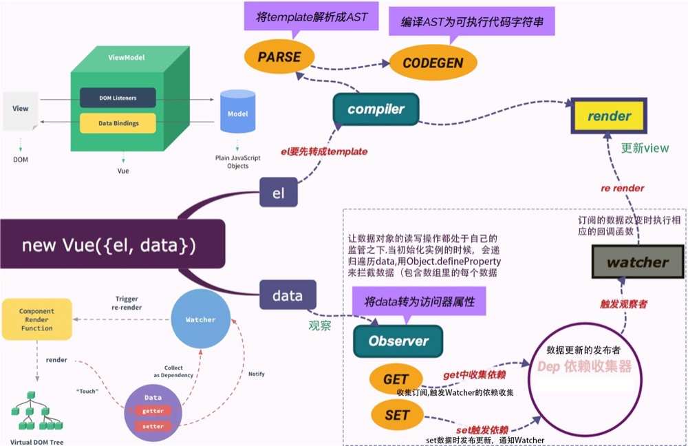

# Vue 2 响应式原理

数据通过 Observer 植入`__ob__`不可遍历的属性标记为响应式，
通过 Dep 类创建独立的 watcher，使用 defineReative 函数封装的 object.definePrototype 进行依赖收集和派发更新

#### 步骤

1. new Dep()
2. observe()
3. get()
   1. Dep.target
   2. dep.depend() // 依赖收集
   3. childOb.dep.depend()
   4. isArray -> dependArray()
4. set()
   1. childOb
   2. dep.notity() // 派发更新

### 什么时候进行定义

在 `_init()` 的 initState(vm) 中进行 props,data,computed 响应式绑定。

### defineReative 实现响应式原理

defineReative 通过对 Object.definePrototype 的一个封装处理 getter 和 setter 方法。

1. 进行【依赖收集】和【派发更新】
2. 给每一个对象和数组递归打上`__ob__`不可枚举的属性。

### Dep 类

每次 new Dep() 都是内部 id 自增，并把 watcher 推入到栈中，内置了 depend(依赖收集)/notity(派发更新)等方法

#### Dep 类是栈形式

因为压栈/出栈的操作目的是因为组件是嵌套(父子)的形式，为了在组件渲染阶段保持正确的依赖顺序。

#### Dep.target 作用

Dep.target 类型是 Watcher
每次 new Dep() 都生成静态的 target 属性(Dep.target)，就是各种 watcher 的实现。

> 通过 Watcher 类的 `get()` 把当前 Watcher 实例压栈到 target 栈数组中，然后把 Dep.target 设置为当前的 Watcher 实例

### Observer 类的作用

作为观察者。
将数据通过`object.definePrototype `转换为访问器属性，

- Observer 构造方法：递归添加 `__ob__` 属性
- observe()：为 value 创建一个观察者 Observer，已有观察者的，则返回现有的观察者。
- defineReactive(): 通过 Object.defineProperty 劫持 getter、setter，并创建对应的 Dep 对象。

### def() 方法

`Object.defineProperty` 设置 `Enumerable: false`
目的是让**ob**在对象属性遍历的时候不可被枚举出来。

### observeArray 方法

遍历递归调用 observe()给数组元素设置设置响应式

> 注意：对象 configurable: false 不定义响应式对象

#### 如何数组劫持

1. 通过改写原生数组的方法: `['push', 'pop', 'shift', 'unshift', 'splice', 'sort', 'reverse']`

2. 触发 `ob.dep.notify()`

### 依赖收集

依赖收集就是对订阅数据变化的 Watcher 收集的过程。
响应式数据变化通过触发 setter 通知对应的订阅者。

#### 依赖收集的实现

每次 new Dep() 都是内部 id 自增，并生成静态的 target，执行 depend 方法执行 `Dep.target.addDep(this)`

### 派发更新

当数据变动的时候，通知所有订阅了这个数据变化的 Watcher(既 Dep 依赖)执行更新。

#### 数据变动触发派发更新的方式

- Object.defineProperty() 方法中 setter
- 七种数组变异方法被调用
- Vue.set 或者 this.$set
- Vue.delete 或者 this.$delete

#### 如何通知 Watcher

1. 执行 `dep.notify()`，里面执行 sub 数组的 update()
2. update() 执行 queueWatcher()
3. 执行调度中心
   1. 根据不同的 watcher 做不同更新
   2. 回调执行 activated 和 updated 钩子函数

#### 更新类型有什么

- render watcher：触发组件重新进行渲染
- computed watcher：对计算属性重新求值
- user watcher：调用用户提供的回调函数

### object.definePrototype 注意事项

以下不能触发 setter

#### 对象

1. 新增一个属性，因为新增的属性不是响应式的(`Vue.set()`)
2. 响应式对象删除一个已有属性(`vue.delete()`)

#### 数组

1. 通过索引直接修改数组，因为没监听数组索引
2. 修改数组长度 (`Array.splice()`)

### Vue.set 实现

1. 判断是否是数组，通过 splice() 进行新增
2. 通过响应式值得 `__ob__` 找到对应的 Dep
3. 更新响应式数据 `defineReactive(ob.value, key, val)`
4. 派发更新 `ob.dep.notify()`

### Vue.delete 实现

1. 判断是否是数组，通过 splice() 进行删除
2. 通过响应式值得 `__ob__` 找到对应的 Dep
3. 派发更新 `ob.dep.notify()`

### Vue.observable 实现

调用 `observe()`

### 为什么 Array 型数据会有不同的变化侦测方式

出于性能考虑。
`Object.defineProperty` 可以监听数组的值。

1. 数组过长加重 getter 和 setter 负担(循环)。
2. 对象数组触发 getter 和 setter 会依次读取数组的值

### 为什么 响应式数据不监听下标

出于性能考虑。
每次下标改动都是会触发数组遍历更新试图，随着数据长度增加会呈现指数增长，对比于使用 `数组更新检测`
