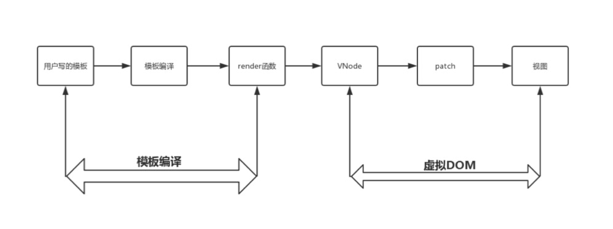

# 模板编译

模板编译分为三个阶段：
parse(解析)，optimize(优化)，generate(生成)render 函数。

- 模板解析阶段(parse)：模板 Template 被正则解析，转化为 AST；
- 优化阶段(optimize)：遍历 AST，找出静态节点标记，为了 DOM-DIFF 的时候跳过，优化 runtime 性能；
- 代码生成阶段(generate)：AST 转为 Render function。

### 渲染整体流程

#### 静态节点

节点类型是 text、非 vif-else、没动态绑定、slot, component、父节点不是 vfor、不是组件类型。

DOM-Diff 算法会跳过静态节点，较少比较，优化了 patch 的性能。

#### runtime

利用 render 里的 h 函数来创建 HTML 节点

### 模板预编译

模板会在构建时编译一次，转为 render function，可以让实际组件在 runtime 时跳过模板编译。

### template 和 jsx 的有什么分别

对于 runtime 来说，两者都转为 render 函数提供渲染。
JSX 在复杂组件中具有优势更加灵活，template 代码上更符合视图与逻辑分离。

webpack 使用 vue-loader 编译.vue 文件。
