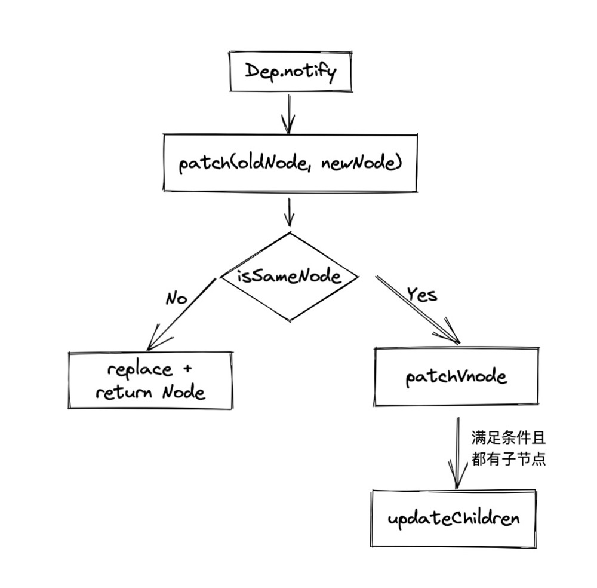

# vue2 diff 算法

### 流程

数据变化时，调用 Dep.notify 通知订阅者 Watcher，订阅者调用 patch 给真实 DOM 打补丁，diff 算法就在打补丁中。



#### patch

patch 通过判断新老 Vnode 是否有相同条件（sameVnode）执行 patchVnode

#### patchVnode

1. 匹配文本
2. 匹配子节点
3. 当都有子节点时候执行 updateChildren 比较子节点

#### updateChildren

1. 拿到新老节点的数组，初始化四个指针，分别指向新老节点的起始
2. 同位和交叉匹配，匹配上就交换位置，并移动指针
3. 匹配不上就根据 key 换成 hash 表匹配，没 key 就直接替换
   （这里也解释了 for 要用 key）


#### sameVnode

1. key 相同
2. tag 标签相同
3. 是否相同注释节点
4. data 数据相同(onclick、style)
5. input 标签时，type 相同

```
function sameVnode (a, b) {
  return (
    a.key === b.key &&
    a.tag === b.tag &&
    a.isComment === b.isComment &&
    isDef(a.data) === isDef(b.data) &&
    sameInputType(a, b)
  )
}
```

### diff 深度优先算法

patchVnode 调用 updateChildren 可知是深度优先算法。

参考
https://segmentfault.com/a/1190000020663531
