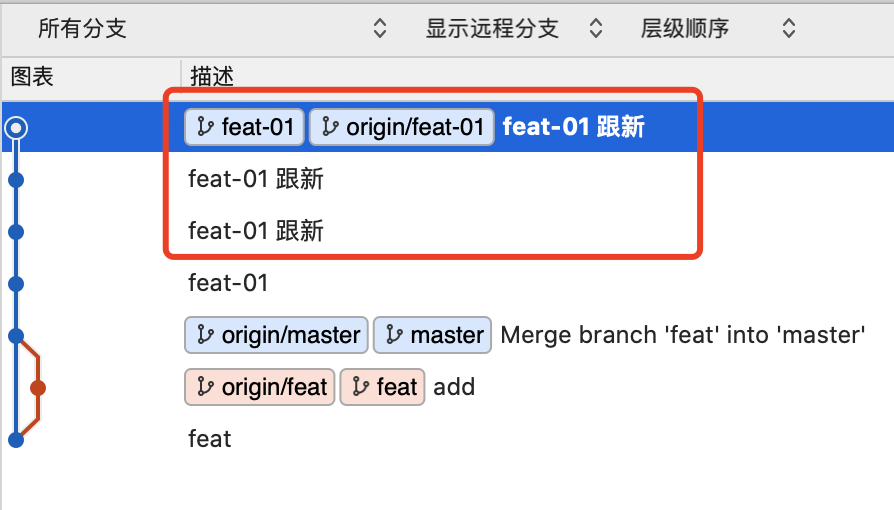
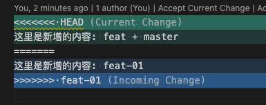
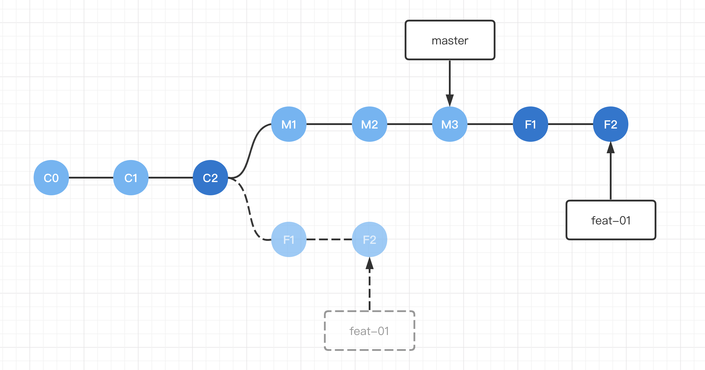

# git rebase
> git-rebase: Forward-port local commits to the updated upstream head

将一个分支集成到另一个分支, 将一系列提交组合到新的提交的过程。

## 目录
1. 我工作中的使用步骤
2. 各种使用细节
3. 原理分析
4. 对外如何介绍

## 结论
1. 和 ``git merge`` 功能一样都是合并两条分支的commit。
2. 与 merge 相比没额外的 merge 合并信息，更优雅显示在同一条流上.(把目标分支新增的 commit 生成 patch 并迁移到合并分支)
3. 避免在公共的分支执行 rebase 操作，会覆盖其他的人提交的 commit 历史记录。

## 1. 工作的使用
已知远程分支 master，本地默认分支 master。
远程分支 master 和本地分支 feat 的操作。
```
<!-- 先创建个分支 -->
# master

- git fetch origin master // 拉取远程 master 分支
- git checkout -b feat // 查找并切换到分支 feat (-b 在查找过程中没有就新建)

<!-- 进行开发 -->
# feat

（... do soming edit）
- git add . // 文件添加到暂存区
- git commit -m 'feat edit' // 将暂存区内容添加到本地仓库中
- git checkout master

<!-- 开发完准备提交代码到远程 master，先跟新远程内容到本地 -->
# master

- git pull origin master // 拉取最新远程 master 分支
- git checkout feat

<!-- 合并两个分支，解决冲突后提交我们分支代码 -->
# feat

- git rebase master // rebase
（... 解决冲突）
- git push origin feat
```

## 2. rebase 过程中解决冲突
``git rebase (--continue | --skip | --abort | --quit | --edit-todo | --show-current-patch)``

合并过程中会生成一条临时分支，这条临时分支就是处理冲突:


*可以看到，此时的分支从 feat-01 变成临时分支 91b9...!(Rebasing)*

``git rebase --continue``： 如果处理完冲突，执行 ``git commit``操作保存当前的 commit 信息，如果此时还是临时分支，执行该命令，进行下一个 commit 节点检索。

``git rebase --skip``: 让我们忽略这次的 commit 节点，进入到下一次 commit 节点.

``git rebase --abort``: 放弃合并，退出此次 rebase 并回到 rebase 操作之前的状态。(也就是把这个临时分支强制退出并切换到 feat-01)

将所有新的 commit 进行冲突检索并处理完之后，临时分支会被删除，当前处理的 commit 最终会指向替换为 feat-01。

**注意：当我们在 Rebasing 的时候可以执行 ``git rebase --abort`` 退出回到原始，如果合并完成了就只能使用 ``git reset`` 等操作回退版本**

## 3. git rebase -i 多条记录合并
我们的 commit 信息比较多重复需要合并处理


以图为例子：
我需要合并前3条 commit 信息为一条。执行 ``git rebase -i HEAD~3 ``，展示如图：


*留意前三个 pick，他们依次倒叙，最后一条 pick 为最新提交的 commit*

我们使用``s, squash <commit> = use commit, but meld into previous commit``进行合并，操作如 vim。


*我们必须要留一条 pick，但 pick 不能是最后一条(squash 规则)*

``!qw``退出编辑并保存，此时 git 又会提供临时分支：


我们无改动只需要再次 ``!qw``退出编辑并保存即可。

那么我们就得到了一条合并之后的信息：


如果我们在第一次保存退出，git又给我提供了临时分支的那步骤执行了 ``git commit`` 操作，就会多一条合并记录:


## 4. rebase 理解
### git rebase 解决了什么
让分支变得整洁，减少使用 merge 产生的合并记录。

#### 本地分支 feat-01 新增内容后，在当前分支使用 ``git pull`` 拉取 origin master，解决冲突后再提交：


这个时候我们做了一次提交会提交2个 commit (主内容 feat-01 和 merge 信息): 


#### 本地分支 feat-01 新增内容后，在 master 分支使用 ``git pull`` 拉取 origin master，再切回 feat-01 解决冲突后再提交：


这时我们得到的提交 commit 只有一个，而且也跟分支 master 在同一条线上：


### 当执行 git rebase 时做了什么
以在 feat-01 执行 ``git rebase master`` 为例：

1. git 找到 feat-01 和 master 的共同 commit 记录
2. 把 feat-01 共同 commit 之后里面的每个 commit 提出临时保存成 patch 文件，存在 .git/rebase 目录下
3. 将提出的 commit 更新到 master 分支的最新提交的后面
4. 将 feat-01 分支指向最后一个 commit



**注意：在 feat-01 分支 执行 git rebase master 时，是基于 master 为基础，所以 current change 是 master，Incoming change了 feat-01 **


## 危险操作
### 多人同分支开始使用 rebase 会覆盖其他的 commit 历史记录 .
不要对一个共享的、已在公共库上的分支进行 rebase 操作。只有私有分支才适用 rebase 。

